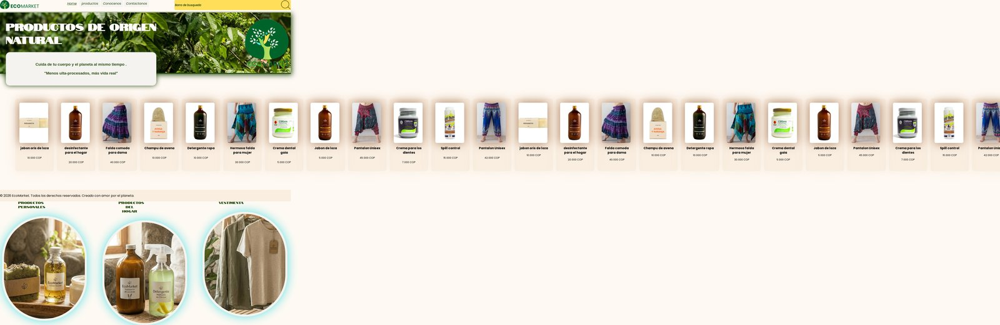
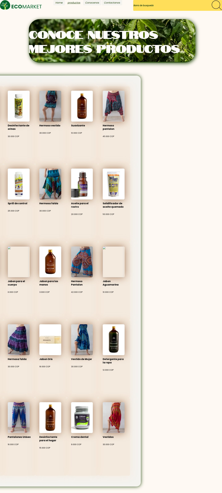
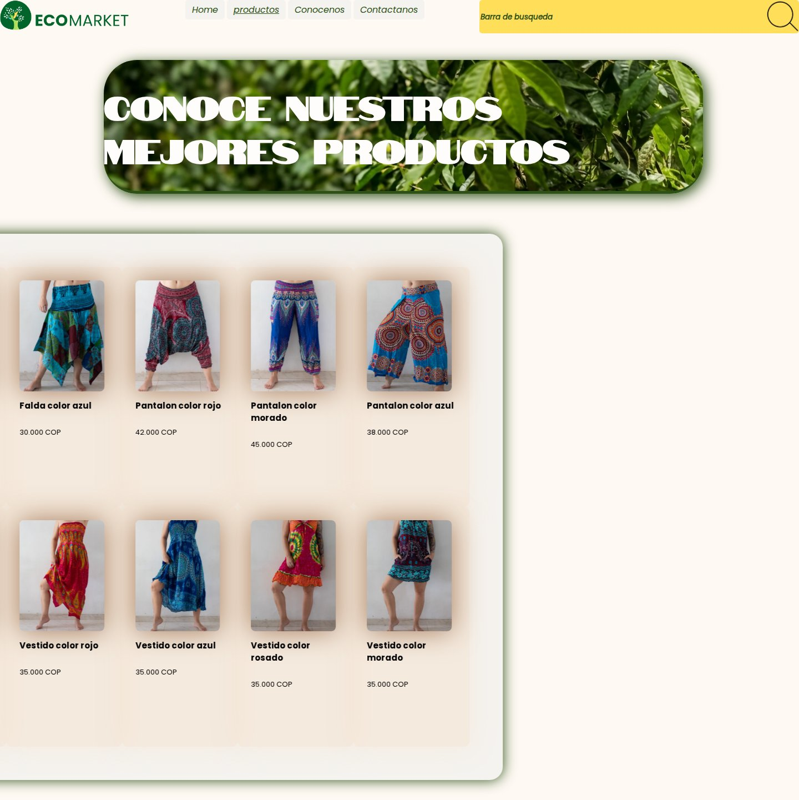
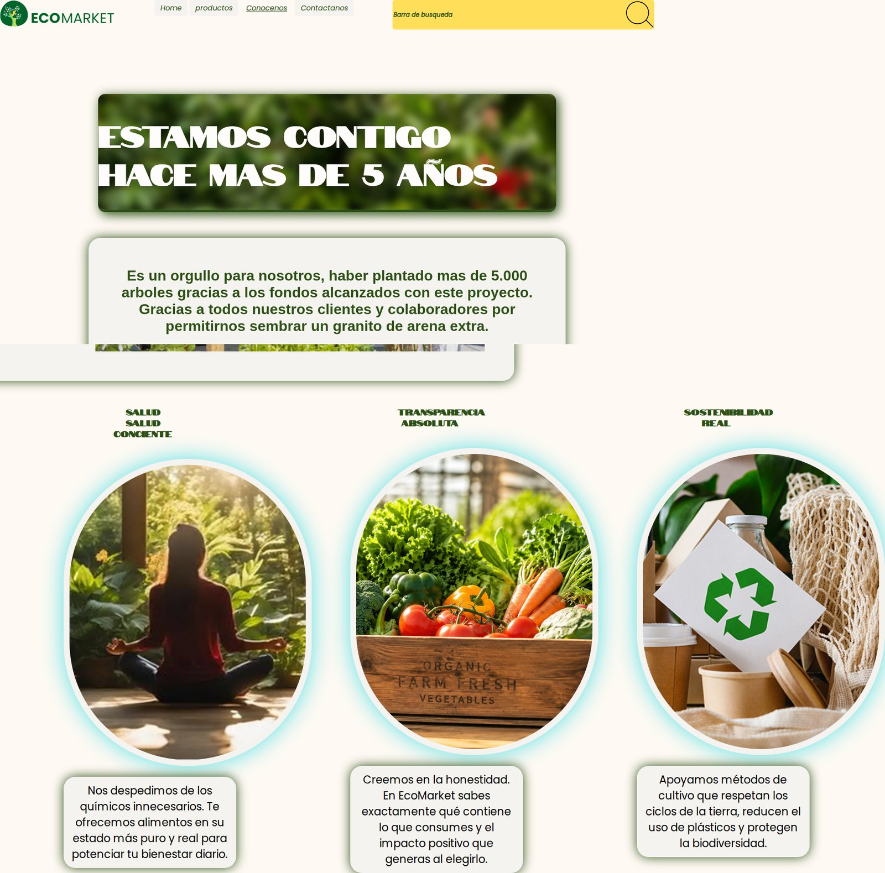
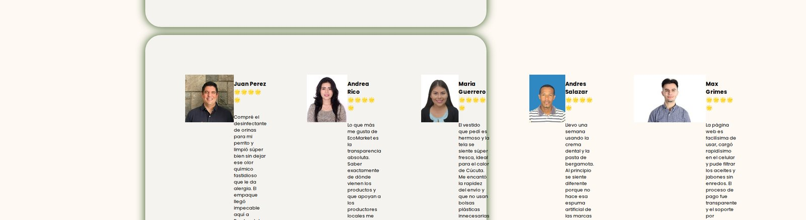
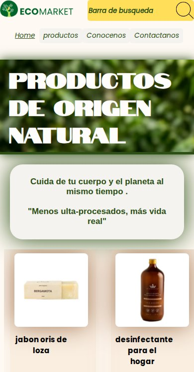

<div align="center">


### Productos de origen natural para tu cuerpo y el planeta


</div>

---

## 🌱 Sobre el proyecto

**EcoMarket** es un sitio web de una tienda ficticia de productos ecológicos, desarrollado como proyecto práctico para aplicar habilidades de **HTML5** y **CSS3**: maquetación, componentes reutilizables, diseño responsive y animaciones, sin frameworks ni JavaScript.

El diseño y el catálogo de productos toman como referencia la tienda real [EcoMarket Colombia](https://ecomarketcolombia.com/index.php/store/), adaptando su estructura a tres categorías propias:

- 🧴 **Productos personales** (aceites, jabones, cremas dentales, champús)
- 🏠 **Productos del hogar** (detergentes, desinfectantes, jabón de loza)
- 👗 **Vestimenta** (faldas, vestidos, pantalones)

## 📸 Vista previa

<table>
<tr>
<td width="50%">

**Página de inicio**


</td>
<td width="50%">

**Catálogo de productos**


</td>
</tr>
<tr>
<td width="50%">

**Categoría: Vestimenta**


</td>
<td width="50%">

**Conócenos**


</td>
</tr>
<tr>
<td width="50%">

**Opiniones de clientes**


</td>
<td width="50%">

**Vista responsive (móvil)**


</td>
</tr>
</table>

## ✨ Características

- **Header y navegación fijos** con logo, menú y barra de búsqueda (interfaz) presentes en todas las vistas.
- **Carrusel de productos destacados** en el home, con desplazamiento horizontal animado en escritorio.
- **Catálogo completo** en `productos.html`, filtrable por categoría desde 3 páginas dedicadas (`Aceites`, `Hogar`, `Ropa`).
- **Sección "Conócenos"** con historia de la marca y valores (salud consciente, transparencia, sostenibilidad).
- **Formulario de contacto** con datos de ubicación, correo y WhatsApp, más una página de agradecimiento tras el envío.
- **Testimonios de clientes** con foto, calificación en estrellas y comentario.
- **Diseño responsive** con breakpoints para móvil y tablet (`@media` en las 4 hojas de estilo).
- **Animaciones CSS propias** (`@keyframes`) para entradas de sección y desplazamiento lateral del carrusel.
- **Tipografía de marca personalizada** (ver sección de fuentes).

## 🛠️ Tecnologías utilizadas

| Tecnología | Uso |
|---|---|
| **HTML5** | Estructura semántica de las 8 vistas del sitio |
| **CSS3** | Estilos, layout con Flexbox/Grid, `@media queries` y `@keyframes` |
| **Fuentes locales (`@font-face`)** | Tipografías de marca cargadas desde `/fonts` |
| **Git & GitHub** | Control de versiones ([repositorio](https://github.com/tecnicajesus20-code/EcoMarket_KleidersonSalcedo)) |

## 🔤 Tipografías

El proyecto usa 3 fuentes personalizadas, guardadas en `/fonts` (archivos `.ttf`/`.otf`, más sus `.zip` originales en `/fonts/ArchivosZIP`):

| Fuente | Uso |
|---|---|
| **Notable** | Títulos principales |
| **Poppins** (Regular, Bold, Italic) | Tipografía base de todo el sitio |
| **Catchy Mager** | Descripciones y textos destacados |

## 📁 Estructura del proyecto

```
EcoMarket_KleidersonSalcedo/
├── index.html                    # Página de inicio
├── views/
│   ├── productos.html            # Catálogo completo
│   ├── sobre-nosotros.html       # Historia y valores de la marca
│   ├── Contactanos.html          # Formulario + testimonios
│   ├── Agradecimientos.html      # Confirmación de envío del formulario
│   └── Categorias/
│       ├── Aceites.html          # Categoría: productos personales
│       ├── Hogar.html            # Categoría: productos del hogar
│       └── Ropa.html             # Categoría: vestimenta
├── Css/
│   ├── Main.css                  # Variables, fuentes y estilos base
│   ├── layout.css                # Estructura general y responsive
│   ├── components.css            # Componentes (cards, botones, formularios)
│   └── animations.css            # Animaciones (@keyframes)
├── fonts/                        # Tipografías de marca (ttf/otf + zips originales)
├── img/
│   ├── Icons/Logos/               # Logos del proyecto
│   ├── Icons/Recursos/            # Íconos de categorías y fotos de clientes
│   ├── Productos/                 # Fotos de producto por categoría
│   └── hero/                      # Imagen de fondo del encabezado
├── docs/screenshots/              # Capturas usadas en este README
└── README.md
```

## 🚀 Cómo verlo localmente

Es un sitio 100% estático, así que no necesita instalación ni dependencias.

1. Clona o descarga este repositorio.
2. Abre `index.html` directamente en tu navegador,

   **o**, para evitar problemas de rutas relativas, sírvelo con un servidor local:
   ```bash
   # Con Python
   python3 -m http.server 8080

   # Con la extensión "Live Server" de VS Code
   # clic derecho sobre index.html → "Open with Live Server"
   ```
3. Navega desde el menú superior entre **Home**, **Productos**, **Conócenos** y **Contáctanos**.

## 🗺️ Mapa del sitio

| Página | Ruta |
|---|---|
| Inicio | `index.html` |
| Productos | `views/productos.html` |
| Categoría · Productos personales | `views/Categorias/Aceites.html` |
| Categoría · Hogar | `views/Categorias/Hogar.html` |
| Categoría · Vestimenta | `views/Categorias/Ropa.html` |
| Conócenos | `views/sobre-nosotros.html` |
| Contáctanos | `views/Contactanos.html` |
| Agradecimientos | `views/Agradecimientos.html` |

## 📌 Notas y próximos pasos

Al ser un proyecto de práctica, hay detalles pendientes por pulir:

- El botón de búsqueda y el formulario de contacto son solo de interfaz (aún no procesan datos reales).
- Algunos contenedores con márgenes en unidades `vh` pueden desbordarse en resoluciones muy anchas; es un buen candidato para revisar y ajustar a unidades más estables (`%`, `rem`).
- Ideas a futuro: carrito de compras, filtrado dinámico de productos y newsletter funcional en el footer.

## 👤 Autor

Proyecto desarrollado por **Kleiderson Salcedo** como práctica de desarrollo web front-end.

## 📄 Licencia

Proyecto con fines educativos. Los nombres, productos y datos de contacto mostrados son ficticios.
